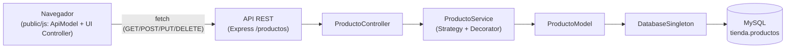

# Parcial - Gestión de Inventario (MVP)

 Integrantes: Aguirre Claudio 
              Albano Julieta 
              Windholz Cristhian 

Aplicación CRUD de inventario de productos que cumple **arquitectura MVC** y tres **patrones de diseño**: Singleton, Decorator y Strategy.

> **Nota (entrega individual):** esta documentación describe la arquitectura de referencia en la rama `rama-AlbanoJulieta` (última actualización del grupo). Al unificar el repositorio, el README final debe coincidir con el código fusionado.

## Stack

- Backend: Node.js + Express (MVC)
- Base de datos: MySQL
- Frontend: HTML + CSS + JavaScript vanilla (MVC)

## Flujo de la aplicación (diagrama)

El recorrido de una petición CRUD desde el cliente hasta la base de datos:



**Lectura del flujo:** el navegador no accede a MySQL directamente. Envía JSON a la API; el controlador solo traduce HTTP (status, parámetros, body); el servicio aplica reglas de negocio y patrones; el modelo ejecuta SQL; el Singleton centraliza la conexión hacia MySQL.

## Arquitectura MVC

### Backend (`src/`)

| Capa | Responsabilidad | Archivos |
|------|-----------------|----------|
| **Entidad** | Objeto de dominio (datos del producto) | `models/Producto.js` |
| **Modelo** | Solo persistencia CRUD (SQL) | `models/ProductoModel.js` |
| **Servicio** | Lógica de negocio; usa Strategy y Decorator | `services/ProductoService.js` |
| **Vista** | No aplica en API REST (la respuesta JSON es la salida) | — |
| **Controlador** | Solo HTTP: validación de request, status y JSON | `controllers/ProductoController.js` |
| **Rutas** | Enrutamiento Express | `routes/productoRoutes.js` |

**Separación de responsabilidades — Datos vs Lógica:** `Producto` es la entidad de dominio: solo almacena los campos del producto (`id`, `nombre`, `precio`, `stock`, `marca`) y expone `toJSON()` para serializarse; no tiene acceso a la base de datos ni reglas de negocio. `ProductoModel` es exclusivamente la capa de persistencia: ejecuta las consultas SQL sobre MySQL a través de `DatabaseSingleton` y convierte las filas en instancias de `Producto`, sin conocer nada de precios ni descripciones. Toda la lógica de negocio —el cálculo de precio según Strategy y el armado de la descripción mediante Decorator— reside únicamente en `ProductoService`, que orquesta modelo y patrones antes de devolver los datos listos al controlador.

### Frontend (`public/js/`)

| Capa | Responsabilidad | Archivos |
|------|-----------------|----------|
| **Modelo** | Comunicación con la API | `models/ProductoApiModel.js` |
| **Vista** | Renderizado del DOM | `views/ProductoView.js` |
| **Controlador** | Eventos y coordinación | `controllers/ProductoUIController.js` |

## Patrones de diseño

Cada patrón responde a un **problema concreto** del dominio. En todos los casos se evaluó una alternativa más simple y se descartó por mantenibilidad o acoplamiento.

### 1. Singleton (`src/config/DatabaseSingleton.js`)

Garantiza **una única conexión** a MySQL en toda la aplicación.

```js
const db = DatabaseSingleton.obtenerInstancia();
```

| | Detalle |
|---|--------|
| **Problema real** | Sin centralizar la conexión, cada capa (`ProductoModel`, futuros módulos, tests mal aislados) podría llamar a `mysql.createConnection()` por su cuenta. Eso duplica host/usuario/base, abre varias conexiones simultáneas innecesarias y, en XAMPP con límites bajos, puede agotar el pool del servidor o dejar conexiones colgadas si no se cierran bien. |
| **Alternativa descartada** | **Nueva conexión por operación** (crear y cerrar en cada query): simple de escribir al principio, pero muy costosa en latencia y recursos. **Connection pool** (`mysql2.createPool()`): mejor para producción y alta concurrencia, pero añade configuración (tamaño del pool, timeouts) que no aporta al objetivo pedagógico del MVP. |
| **Decisión** | Singleton con una conexión reutilizable: un solo punto de configuración, adecuado para tráfico bajo del parcial. Documentado el trade-off para migrar a pool si el proyecto escala. |

**Trade-off: Conexión única vs Connection Pool**

Este MVP implementa Singleton con una **conexión única**:
- ✅ **Ventajas:** Simplicidad, bajo consumo de memoria, fácil de mantener
- ❌ **Limitaciones:** No es escalable; con muchos requests concurrentes, todos usan la misma conexión (cuello de botella)

**Para producción**, es recomendable usar **Connection Pool** (`mysql2.createPool()`):
- Múltiples conexiones reutilizables → mejor concurrencia
- Si una conexión falla, otras siguen disponibles → mayor resiliencia
- Costo: mayor consumo de memoria

### 2. Decorator (`src/patterns/decorator/ProductoDecorator.js`)

Añade dinámicamente etiquetas a la descripción del producto:

- **Stock bajo** si `stock < 5`
- **Marca premium** si la marca es Samsung, Apple, Sony o LG

| | Detalle |
|---|--------|
| **Problema real** | La “ficha” del producto en listados debe mostrar alertas distintas según stock y marca. Si cada regla se implementa con `if` sueltos en `ProductoService` o en el HTML del frontend, cada nueva etiqueta (por ejemplo “oferta vencida”, “envío gratis”) obliga a tocar los mismos métodos o plantillas y el código se vuelve un bloque de condiciones difícil de probar por separado. |
| **Alternativa descartada** | **Herencia** (`Producto`, `ProductoConStockBajo`, `ProductoPremium`, combinaciones múltiples): crece en explosión de subclases al combinar reglas. **Strings armados en el controlador o en la vista:** viola MVC al mezclar presentación con HTTP o DOM. |
| **Decisión** | Cadena de decoradores (`ProductoComponente` → alerta stock → marca premium) que envuelven la descripción base sin modificar la entidad `Producto` ni las consultas SQL. |

### 3. Strategy (`src/patterns/strategy/PrecioStrategy.js`)

Intercambia el algoritmo de cálculo de precio en tiempo de ejecución:

| Estrategia | Regla |
|------------|-------|
| `lista` | Precio original |
| `mayorista` | 15% de descuento |
| `promocion` | 25% de descuento si stock ≥ 10 |

Se selecciona desde el frontend o con query: `GET /productos?estrategia=mayorista`

| | Detalle |
|---|--------|
| **Problema real** | El mismo catálogo debe mostrarse con precio de lista, mayorista o promoción según el contexto del usuario, sin duplicar endpoints ni tablas en MySQL. La regla de promoción además depende del stock (`stock >= 10`), no solo de un porcentaje fijo. |
| **Alternativa descartada** | **`if/else` o `switch` grande** dentro de `ProductoService` o del controlador: funciona con tres casos, pero cada nueva estrategia (por ejemplo “empleado”) rompe el principio abierto/cerrado y mezcla transporte HTTP con reglas de precio. **Tres rutas distintas** (`/productos-lista`, `/productos-mayorista`, …): repite listados y validaciones. |
| **Decisión** | `PrecioContexto` delega en `PrecioListaStrategy`, `PrecioMayoristaStrategy` o `PrecioPromocionStrategy`; el servicio solo indica el tipo recibido por query o UI. |

## Estructura del proyecto

```
Parcial-1/
├── server.js                 # Punto de entrada
├── src/
│   ├── config/
│   │   └── DatabaseSingleton.js
│   ├── models/
│   ├── services/
│   ├── controllers/
│   ├── routes/
│   └── patterns/
│       ├── decorator/
│       └── strategy/
└── public/
    ├── index.html
    ├── style.css
    └── js/
        ├── models/
        ├── views/
        ├── controllers/
        └── app.js
└── __tests__/                # Pruebas unitarias con Jest
```

## Requisitos

- [Node.js](https://nodejs.org/)
- [XAMPP](https://www.apachefriends.org/) (MySQL) — solo necesario para ejecutar la app completa con persistencia

## Instalación

```bash
npm install
```

## Base de datos

En phpMyAdmin:

```sql
CREATE DATABASE IF NOT EXISTS tienda;
USE tienda;
CREATE TABLE IF NOT EXISTS productos (
  id INT AUTO_INCREMENT PRIMARY KEY,
  nombre VARCHAR(100) NOT NULL,
  precio DECIMAL(10,2) NOT NULL,
  stock INT NOT NULL DEFAULT 0,
  marca VARCHAR(100) NOT NULL
);
```

Configuración MySQL en `src/config/DatabaseSingleton.js` (host, user, password, database).

## Ejecución

```bash
npm start
```

Abrir en el navegador: **http://localhost:3000**

El servidor sirve el frontend y la API en el mismo puerto.

## Pruebas

Ejecutar las pruebas unitarias con:

```bash
npm test
```

- Los tests son unitarios y no requieren que XAMPP o MySQL estén ejecutándose.
- Si se testea `src/models/ProductoModel.js`, debe mockearse `src/config/DatabaseSingleton.js` para evitar ejecutar SQL directo en las pruebas.

## API REST

| Método | Ruta | Descripción |
|--------|------|-------------|
| GET | `/productos?estrategia=lista` | Listar con precio calculado y descripción decorada |
| GET | `/productos/:id?estrategia=promocion` | Buscar por ID |
| POST | `/productos` | Crear |
| PUT | `/productos/:id` | Actualizar |
| DELETE | `/productos/:id` | Eliminar |

## Criterio de “listo”

El proyecto se considera **listo para entregar / unificar** cuando se cumple todo lo siguiente (verificable en la rama integrada, referencia: `rama-AlbanoJulieta`):

### Consigna y documentación

- [ ] **Diagrama** en este README (Mermaid): Navegador → API → Controller → Servicio → Modelo → Singleton → MySQL.
- [ ] **Patrones documentados** con problema real y alternativa descartada (Singleton, Decorator, Strategy).
- [ ] README con stack, estructura, instalación, BD, ejecución y API.

### Arquitectura y código

- [ ] **MVC backend**: rutas → controlador → servicio → modelo; entidad `Producto` separada de SQL.
- [ ] **MVC frontend**: `ProductoApiModel`, `ProductoView`, `ProductoUIController`.
- [ ] **Singleton** en `DatabaseSingleton.js`; el modelo no crea conexiones propias.
- [ ] **Decorator** aplicado en listados/detalle (`descripcion` enriquecida).
- [ ] **Strategy** seleccionable vía `?estrategia=` (lista, mayorista, promocion).

### Funcionalidad

- [ ] CRUD completo de productos persiste en MySQL (`tienda.productos`).
- [ ] Validaciones de negocio en servicio (`ValidationError` → HTTP 400).
- [ ] Frontend en `http://localhost:3000` consume la API sin errores de CORS en entorno local.

### Calidad

- [ ] `npm start` levanta servidor y sirve `public/`.
- [ ] `npm test` pasa (tests de Strategy, Decorator y/o Service según rama).
- [ ] Credenciales y rutas de BD documentadas o alineadas con XAMPP local del equipo.

### Integración final (equipo)

- [ ] Ramas individuales fusionadas en una rama principal sin conflictos en `README.Md` y `src/`.
- [ ] Tras el merge, el diagrama y las rutas del README coinciden con los archivos reales del repo unificado.
