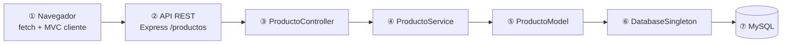

# Parcial - Gestión de Inventario (MVP)

**Integrantes**

| Integrante | Rol en el equipo |
|------------|------------------|
| Aguirre Claudio | Backend MVC, patrones, API REST, estructura `src/` y `public/` |
| Albano Julieta | Tests con Jest, validaciones, integración y rama de referencia más actualizada |
| Windholz Cristhian | Documentación (`README.Md`): diagrama, patrones 3.3/3.4, criterio de listo, Git y guía oral |

Aplicación CRUD de inventario de productos que cumple **arquitectura MVC** y tres **patrones de diseño**: Singleton, Decorator y Strategy.

> **Rama de referencia (código):** `rama-AlbanoJulieta` — contiene la implementación y los tests más recientes del grupo.  
> **Rama de esta entrega (documentación):** `rama-WindholzCristhian` — incluye este README ampliado para la consigna y la defensa oral.

---

## Índice

1. [Stack y arquitectura MVC](#1-stack-y-arquitectura-mvc)
2. [Diagrama de flujo (ítem consigna)](#2-diagrama-de-flujo-ítem-consigna)
3. [Patrones de diseño](#3-patrones-de-diseño)
   - [3.1 Singleton](#31-singleton)
   - [3.3 Decorator](#33-decorator)
   - [3.4 Strategy](#34-strategy)
4. [Ejecutar tests (`npm test`)](#4-ejecutar-tests-npm-test)
5. [Git y trabajo en equipo](#5-git-y-trabajo-en-equipo)
6. [Criterio de “listo”](#6-criterio-de-listo)
7. [Guía para defensa oral](#7-guía-para-defensa-oral)
8. [Instalación, BD, ejecución y API](#8-instalación-bd-ejecución-y-api)

---

## 1. Stack y arquitectura MVC

- **Backend:** Node.js + Express (MVC en `src/`)
- **Base de datos:** MySQL (XAMPP)
- **Frontend:** HTML + CSS + JavaScript vanilla (MVC en `public/js/`)

### Backend (`src/`)

| Capa | Responsabilidad | Archivos |
|------|-----------------|----------|
| **Entidad** | Objeto de dominio (datos del producto) | `models/Producto.js` |
| **Modelo** | Solo persistencia CRUD (SQL) | `models/ProductoModel.js` |
| **Servicio** | Lógica de negocio; usa Strategy y Decorator | `services/ProductoService.js` |
| **Controlador** | Solo HTTP: validación de request, status y JSON | `controllers/ProductoController.js` |
| **Rutas** | Enrutamiento Express | `routes/productoRoutes.js` |

**Datos vs lógica:** `Producto` solo guarda campos y `toJSON()`. `ProductoModel` solo ejecuta SQL vía `DatabaseSingleton`. `ProductoService` concentra validaciones, Strategy (precio) y Decorator (descripción).

### Frontend (`public/js/`)

| Capa | Archivos |
|------|----------|
| Modelo (API) | `models/ProductoApiModel.js` |
| Vista (DOM) | `views/ProductoView.js` |
| Controlador UI | `controllers/ProductoUIController.js` |

---

## 2. Diagrama de flujo (ítem consigna)

**Requisito de la consigna:** diagrama que muestre el recorrido **Navegador → API → Controller → Servicio/Modelo → Singleton → MySQL**.



**Qué demuestra cada paso (para corregir / oral):**

| Paso | Componente | Qué hace | Qué NO hace |
|------|------------|----------|-------------|
| ① | Navegador | `fetch` JSON; UI en MVC cliente | No toca MySQL |
| ② | API REST | Enruta verbos HTTP, CORS, JSON | No calcula precios ni SQL |
| ③ | Controller | Parsea `id`, query `estrategia`, códigos HTTP | No conoce tablas ni descuentos |
| ④ | Service | Validación, Strategy, Decorator | No escribe SQL directo |
| ⑤ | Model | `SELECT` / `INSERT` / `UPDATE` / `DELETE` | No aplica reglas de precio |
| ⑥ | Singleton | Una conexión MySQL compartida | No es capa de negocio |
| ⑦ | MySQL | Persistencia `tienda.productos` | — |

**Ejemplo concreto (GET listar):** el usuario elige estrategia `mayorista` en el frontend → `ProductoApiModel` llama `GET /productos?estrategia=mayorista` → `ProductoController.listar` → `ProductoService.listarConPresentacion` → `ProductoModel.obtenerTodos` → `DatabaseSingleton.consultar` → filas en MySQL → el servicio decora descripción y calcula `precioCalculado` → JSON al navegador.

---

## 3. Patrones de diseño

En las subsecciones **3.3** y **3.4** se exige **problema real del dominio** + **alternativa descartada** + **por qué se eligió el patrón** (defendible en oral).

### 3.1 Singleton

**Archivo:** `src/config/DatabaseSingleton.js`

```js
const db = DatabaseSingleton.obtenerInstancia();
```

| | |
|---|---|
| **Problema real** | El inventario se guarda en MySQL. Si `ProductoModel`, un futuro `UsuarioModel` y scripts de mantenimiento cada uno llaman `mysql.createConnection()`, se repiten credenciales, se abren muchas conexiones y en entornos como XAMPP (límite bajo de conexiones) aparecen errores `Too many connections` o conexiones que nadie cierra. |
| **Alternativa descartada A** | **Conexión nueva por query:** fácil al inicio, pero cada operación paga handshake TCP + auth → lento e inestable bajo carga. |
| **Alternativa descartada B** | **Pool (`createPool`):** correcto en producción, pero para el parcial agrega tamaño de pool, timeouts y manejo de cola sin aportar al aprendizaje del patrón Singleton pedido. |
| **Decisión** | Una instancia única (`obtenerInstancia()`) con `consultar()` promisificado; todo el acceso SQL pasa por ahí. |

**Trade-off documentado:** conexión única = simple y suficiente en MVP; en producción migrar a pool por concurrencia.

---

### 3.3 Decorator

**Archivo:** `src/patterns/decorator/ProductoDecorator.js`  
**Uso:** `ProductoService.enriquecerProducto()` → campo `descripcion` en la respuesta JSON.

**Comportamiento**

- Descripción base: nombre, precio, stock, marca.
- `AlertaStockBajoDecorator`: agrega `| ⚠ STOCK BAJO` si `stock < 5`.
- `EtiquetaMarcaPremiumDecorator`: agrega `| ★ MARCA PREMIUM` si marca ∈ {Samsung, Apple, Sony, LG}.

**Problema real (dominio inventario)**

En un listado de depósito, el encargado debe ver **de un vistazo** si hay que reponer stock y si el ítem es de marca premium, **sin cambiar** los datos guardados en la tabla `productos`. Esas reglas son de **presentación enriquecida**, no columnas nuevas en la BD: mañana puede pedirse “producto discontinuado” u “oferta del día” y las reglas se combinan (stock bajo **y** premium a la vez).

**Alternativa descartada 1 — `if` encadenados en el servicio**

```js
// Anti-ejemplo: crece sin control
let desc = `${p.nombre}...`;
if (p.stock < 5) desc += ' | STOCK BAJO';
if (esPremium(p.marca)) desc += ' | PREMIUM';
// cada regla nueva = otro if en el mismo método
```

- **Por qué se descarta:** viola abierto/cerrado; mezcla todas las reglas en un solo método; difícil testear cada regla aislada.

**Alternativa descartada 2 — Herencia**

`class ProductoPremiumConStockBajo extends ProductoPremium extends Producto` …

- **Por qué se descarta:** combinación de N reglas → explosión de subclases (2 decoradores = 4 clases posibles; 3 reglas = 8).

**Alternativa descartada 3 — Lógica en el HTML (`index.html` / vista)**

- **Por qué se descarta:** duplica reglas si mañana hay app móvil o otro cliente; la API debería devolver la misma semántica para todos los clientes.

**Decisión (Decorator)**

Cadena: `ProductoComponente` → `AlertaStockBajoDecorator` → `EtiquetaMarcaPremiumDecorator`. Cada clase envuelve al anterior y solo extiende `obtenerDescripcion()`. La entidad `Producto` y el SQL **no se modifican**.

**Cómo defenderlo en oral (frase lista):** *“Decorator nos permite sumar etiquetas de forma composable; agregar una regla nueva es una clase más en la cadena, no tocar las existentes.”*

**Prueba asociada (rama Albano):** `__tests__/ProductoDecorator.test.js`

---

### 3.4 Strategy

**Archivo:** `src/patterns/strategy/PrecioStrategy.js`  
**Uso:** `PrecioContexto` dentro de `ProductoService`; parámetro `?estrategia=` o selector en UI.

| Estrategia | Clase | Regla |
|------------|-------|--------|
| `lista` | `PrecioListaStrategy` | Precio tal cual en BD |
| `mayorista` | `PrecioMayoristaStrategy` | Precio × 0,85 (−15 %) |
| `promocion` | `PrecioPromocionStrategy` | Precio × 0,75 solo si `stock >= 10` |

**Problema real (dominio inventario)**

La misma fila de producto se vende a **distintos tipos de cliente**: consumidor final (lista), comercio (mayorista) y campaña promocional (descuento condicionado al stock disponible). El precio base vive en MySQL; las reglas de descuento **cambian según contexto** y no deben duplicar productos ni tablas `productos_mayorista`, `productos_promo`, etc.

**Alternativa descartada 1 — `switch` en el servicio**

```js
// Anti-ejemplo
switch (tipo) {
  case 'mayorista': return precio * 0.85;
  case 'promocion': return producto.stock >= 10 ? precio * 0.75 : precio;
  ...
}
```

- **Por qué se descarta:** cada estrategia nueva obliga a editar el mismo `switch`; mezcla reglas de negocio en un solo bloque; el controlador podría tentarse a copiar lógica.

**Alternativa descartada 2 — Tres endpoints**

`/productos-lista`, `/productos-mayorista`, `/productos-promocion`

- **Por qué se descarta:** triplica listados, validaciones y manejo de errores en Controller/Service.

**Alternativa descartada 3 — Columnas extra en BD** (`precio_mayorista`, `precio_promo`)

- **Por qué se descarta:** los precios derivados quedan desincronizados si cambia `precio` o `stock`; la promoción depende del stock **actual**, debe calcularse en tiempo de lectura.

**Decisión (Strategy)**

`PrecioContexto.establecerEstrategia(tipo)` intercambia el algoritmo en runtime. El servicio expone `precioCalculado` y `estrategia` en JSON sin que el modelo SQL conozca descuentos.

**Cómo defenderlo en oral:** *“Strategy encapsula cada política de precio; el cliente elige la estrategia por query y el servicio solo delega en el contexto.”*

**Pruebas asociadas (rama Albano):**

- `__tests__/PrecioListaStrategy.test.js`
- `__tests__/PrecioMayoristaStrategy.test.js`
- `__tests__/PrecioPromocionStrategy.test.js`
- `__tests__/ProductoService.test.js` (validaciones + integración con estrategia)

---

## 4. Ejecutar tests (`npm test`)

> **Estado:** los tests están implementados en **`rama-AlbanoJulieta`** (Julieta). En **`rama-WindholzCristhian`** solo está la documentación hasta que el equipo unifique ramas. Tras el merge, esta sección aplica al repo unificado.

### Requisitos

- Node.js instalado.
- En la carpeta del proyecto (con `package.json` que define el script `test`):

```bash
npm install
npm test
```

El script ejecuta: `jest --runInBand` (tests en serie, más estable con mocks).

### Qué se prueba (sin MySQL)

| Archivo de test | Qué valida |
|-----------------|------------|
| `PrecioListaStrategy.test.js` | Precio sin modificar |
| `PrecioMayoristaStrategy.test.js` | Descuento 15 % |
| `PrecioPromocionStrategy.test.js` | 25 % solo con `stock >= 10` |
| `ProductoDecorator.test.js` | Etiquetas stock bajo / marca premium |
| `ProductoService.test.js` | `validarDatos`, errores `ValidationError` |

- **No hace falta** XAMPP/MySQL corriendo: son pruebas **unitarias**.
- Si se testea `ProductoModel` contra la BD real, hay que **mockear** `DatabaseSingleton` para no ejecutar SQL en Jest.

### Salida esperada

```
PASS __tests__/...
Test Suites: 5 passed
```

Si falla: revisar que estés en la rama con carpeta `__tests__/` y `jest` en `devDependencies`.

---

## 5. Git y trabajo en equipo

### Ramas del repositorio

| Rama | Responsable | Contenido principal |
|------|-------------|---------------------|
| `rama-AguirreClaudio` | Claudio | Proyecto MVC completo (backend, frontend, patrones, `server.js`) |
| `rama-AlbanoJulieta` | Julieta | Misma base + **tests Jest**, validaciones, `.gitignore`; **referencia más actualizada** |
| `rama-WindholzCristhian` | Cristhian | **Este README** (diagrama, 3.3, 3.4, listo, oral, Git) |

### Flujo de trabajo acordado

1. Cada integrante trabaja en **su rama** (entrega individual).
2. La integración se hace al final sobre la rama más completa (`rama-AlbanoJulieta` recomendada como base).
3. El README de `rama-WindholzCristhian` se fusiona para cumplir ítems de documentación de la consigna.

### Cómo mergear el README actualizado

**Opción A — Integrar documentación sobre la rama de Julieta (recomendada)**

```bash
git checkout rama-AlbanoJulieta
git pull origin rama-AlbanoJulieta
git merge rama-WindholzCristhian -m "docs: integrar README (diagrama, patrones 3.3/3.4, tests, oral)"
```

Si Git marca conflicto solo en `README.Md`, conservar las secciones de este archivo (diagrama Mermaid, 3.3, 3.4, criterio de listo, Git, oral) y combinar con cualquier detalle único que hubiera en la rama base.

**Opción B — Traer código de Albano a la rama de Cristhian (solo si el profe pide entregar todo en tu rama)**

```bash
git checkout rama-WindholzCristhian
git merge rama-AlbanoJulieta -m "merge: código y tests de referencia"
# Resolver conflictos; mantener README.Md completo
git push origin rama-WindholzCristhian
```

**Después del merge**

```bash
npm install
npm start          # probar CRUD en http://localhost:3000
npm test           # verificar tests de Julieta
```

### Commits sugeridos (individual)

```bash
# En rama-WindholzCristhian
git add README.Md
git commit -m "docs: diagrama, patrones 3.3/3.4, criterio listo, tests y guía oral"
git push origin rama-WindholzCristhian
```

---

## 6. Criterio de “listo”

Marcar cuando esté verificado en la **rama unificada** (base `rama-AlbanoJulieta` + merge de documentación).

### Documentación (rama Windholz — esta entrega)

- [x] **Diagrama Mermaid** (§2): Navegador → API → Controller → Servicio → Modelo → Singleton → MySQL
- [x] **Patrón 3.3 Decorator:** problema real + alternativas descartadas + decisión
- [x] **Patrón 3.4 Strategy:** problema real + alternativas descartadas + decisión
- [x] **Singleton 3.1** documentado con trade-off pool vs conexión única
- [x] **Sección Git / equipo** (§5): ramas, roles, cómo mergear README
- [x] **Guía defensa oral** (§7)
- [ ] README fusionado sin conflictos en rama final del grupo

### Código y funcionalidad (rama Albano / integrada)

- [ ] MVC backend y frontend operativos
- [ ] CRUD persiste en `tienda.productos`
- [ ] Singleton, Decorator y Strategy en ejecución (`npm start`)
- [ ] `npm test` — **5 suites en verde** (pendiente hasta merge con rama Albano)
- [ ] Validaciones (`ValidationError` → HTTP 400)

### Entrega final equipo

- [ ] Merge de las tres ramas completado
- [ ] Un solo README coherente con el código del repo
- [ ] Demo oral ensayada con diagrama §2 y patrones §3

---

## 7. Guía para defensa oral

Usar este guion de **2–3 minutos**; apoyarse en el diagrama del §2.

### Apertura (20 s)

*“Tenemos un CRUD de inventario con MVC en cliente y servidor, MySQL, y tres patrones: Singleton para la conexión, Strategy para precios según tipo de cliente, y Decorator para enriquecer la descripción en listados.”*

### Recorrido del diagrama (40 s)

1. El **navegador** solo habla HTTP/JSON.
2. La **API** en Express enruta a **ProductoController**.
3. El **servicio** valida y aplica Strategy + Decorator.
4. El **modelo** ejecuta SQL vía **Singleton** hacia **MySQL**.

*“Separar capas evita que el frontend conozca la BD o que el controlador calcule descuentos.”*

### Singleton (30 s)

- **Problema:** muchas conexiones o config duplicada.
- **Descartamos:** pool (complejidad) y conexión por request (lento).
- **Elegimos:** una instancia con `obtenerInstancia()`.

### Decorator — 3.3 (30 s)

- **Problema:** mostrar alertas de stock y marca premium sin nuevas columnas.
- **Descartamos:** if gigante, herencia, lógica en HTML.
- **Elegimos:** cadena de decoradores; ejemplo: TV LG con stock 3 → base + STOCK BAJO + MARCA PREMIUM.

### Strategy — 3.4 (30 s)

- **Problema:** mismo producto, precio según lista/mayorista/promo.
- **Descartamos:** switch, tres endpoints, precios extra en BD.
- **Elegimos:** `?estrategia=mayorista`; promoción depende de `stock >= 10`.

### Tests (20 s)

*“Julieta dejó tests unitarios con Jest; `npm test` no necesita MySQL porque prueban estrategias, decorator y validaciones del servicio.”*

### Cierre (10 s)

*“Mi aporte en la rama Windholz fue documentar arquitectura, diagrama y justificación de patrones para la consigna; el código de referencia está en la rama Albano hasta el merge final.”*

### Preguntas frecuentes del profesor

| Pregunta | Respuesta corta |
|----------|-----------------|
| ¿Por qué no pool? | MVP y consigna Singleton; pool para producción. |
| ¿Dónde está el Decorator? | `ProductoService.enriquecerProducto` → `decorarProducto`. |
| ¿Cómo cambio la estrategia? | Query `estrategia` o selector en UI → `PrecioContexto`. |
| ¿Qué pasa si promoción y stock &lt; 10? | `PrecioPromocionStrategy` devuelve precio lista. |
| ¿Controller tiene lógica de negocio? | No; solo HTTP y delega al servicio. |

---

## 8. Instalación, BD, ejecución y API

### Estructura del proyecto (rama integrada)

```
Parcial-1/
├── server.js
├── src/
│   ├── config/DatabaseSingleton.js
│   ├── controllers/ProductoController.js
│   ├── models/Producto.js, ProductoModel.js
│   ├── services/ProductoService.js
│   ├── routes/productoRoutes.js
│   └── patterns/decorator/, strategy/
├── public/          # frontend MVC
└── __tests__/       # Jest (rama Albano)
```

### Requisitos

- [Node.js](https://nodejs.org/)
- [XAMPP](https://www.apachefriends.org/) (MySQL) — para ejecutar la app con persistencia

### Instalación

```bash
npm install
```

### Base de datos

```sql
CREATE DATABASE IF NOT EXISTS tienda;
USE tienda;
CREATE TABLE IF NOT EXISTS productos (
  id INT AUTO_INCREMENT PRIMARY KEY,
  nombre VARCHAR(100) NOT NULL,
  precio DECIMAL(10,2) NOT NULL,
  stock INT NOT NULL DEFAULT 0,
  marca VARCHAR(100) NOT NULL
);
```

Credenciales en `src/config/DatabaseSingleton.js` (host, user, password, database).

### Ejecución

```bash
npm start
```

Abrir **http://localhost:3000** (frontend y API en el mismo puerto).

### API REST

| Método | Ruta | Descripción |
|--------|------|-------------|
| GET | `/productos?estrategia=lista` | Listar con precio calculado y descripción decorada |
| GET | `/productos/:id?estrategia=promocion` | Buscar por ID |
| POST | `/productos` | Crear |
| PUT | `/productos/:id` | Actualizar |
| DELETE | `/productos/:id` | Eliminar |
