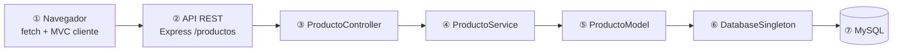

# Parcial - Gestión de Inventario (MVP)

**Integrantes**

| Integrante | Rol en el equipo |
|------------|------------------|
| Aguirre Claudio | Backend MVC, patrones, API REST, estructura `src/` y `public/` |
| Albano Julieta | Tests con Jest, validaciones, integración y rama de referencia más actualizada |
| Windholz Cristhian | Documentación (`README.md`): diagrama, patrones 3.3/3.4, install/run/test, Git |

Aplicación CRUD de inventario de productos que cumple **arquitectura MVC** y tres **patrones de diseño**: Singleton, Decorator y Strategy.

> **Rama de referencia (código):** `rama-AlbanoJulieta` — contiene la implementación y los tests más recientes del grupo.  
> **Rama de esta entrega (documentación):** `rama-WindholzCristhian` — incluye este README ampliado para la consigna.

---

## Índice

- [**Guía rápida: install + run + test**](#guía-rápida-install--run--test) ← empezar aquí
1. [Stack y arquitectura MVC](#1-stack-y-arquitectura-mvc)
2. [Diagrama de flujo (ítem consigna)](#2-diagrama-de-flujo-ítem-consigna)
3. [Patrones de diseño](#3-patrones-de-diseño) (3.1, 3.3, 3.4)
4. [Ejecutar tests (`npm test`)](#4-ejecutar-tests-npm-test) — cuando Albano termine / tras merge
5. [Git y trabajo en equipo](#5-git-y-trabajo-en-equipo)
6. [Criterio de “listo”](#6-criterio-de-listo)
7. [API REST y base de datos](#7-api-rest-y-base-de-datos)

---

## Guía rápida: install + run + test

Pasos en orden para **correr el proyecto completo** y **validar tests**. Usar la rama con código (`rama-AlbanoJulieta`) o la rama ya fusionada del equipo.

### Requisitos previos

| Herramienta | Para qué |
|-------------|----------|
| [Node.js](https://nodejs.org/) (LTS) | `npm install`, `npm start`, `npm test` |
| [XAMPP](https://www.apachefriends.org/) | MySQL en `localhost` — solo para **run** (app con BD), no para **test** |

### Paso 1 — Clonar / actualizar y elegir rama

```bash
git clone <url-del-repo>
cd Parcial_Windholz_Ingenieria
git fetch origin
git checkout rama-AlbanoJulieta    # código + tests (referencia del grupo)
# o, tras el merge final:
# git checkout rama-AlbanoJulieta && git merge rama-WindholzCristhian
```

### Paso 2 — Instalar dependencias

```bash
npm install
```

Instala Express, mysql2, cors y (en rama Albano) **Jest** como devDependency.

### Paso 3 — Base de datos (solo para `npm start`)

1. Iniciar **MySQL** desde el panel de XAMPP.
2. En phpMyAdmin ejecutar:

```sql
CREATE DATABASE IF NOT EXISTS tienda;
USE tienda;
CREATE TABLE IF NOT EXISTS productos (
  id INT AUTO_INCREMENT PRIMARY KEY,
  nombre VARCHAR(100) NOT NULL,
  precio DECIMAL(10,2) NOT NULL,
  stock INT NOT NULL DEFAULT 0,
  marca VARCHAR(100) NOT NULL
);
```

3. Revisar credenciales en `src/config/DatabaseSingleton.js` (`host`, `user`, `password`, `database: 'tienda'`).

### Paso 4 — Ejecutar la aplicación (`npm start`)

```bash
npm start
```

| Verificación | Esperado |
|--------------|----------|
| Consola | `Servidor corriendo en puerto 3000` y `MySQL conectado` |
| Navegador | Abrir **http://localhost:3000** — listado CRUD de productos |
| API | `GET http://localhost:3000/productos?estrategia=lista` devuelve JSON |

**Si falla:** MySQL apagado → error de conexión; puerto 3000 ocupado → cerrar otro proceso Node.

### Paso 5 — Ejecutar tests (`npm test`)

> Aplica cuando la rama incluye la carpeta `__tests__/` (entrega de **Albano Julieta** en `rama-AlbanoJulieta`). No hace falta XAMPP.

```bash
npm test
```

| Verificación | Esperado |
|--------------|----------|
| Salida | `Test Suites: 6 passed` |
| MySQL | **No** debe estar levantado para estos tests unitarios |

Detalle de cada suite → [§4 Ejecutar tests](#4-ejecutar-tests-npm-test).

### Resumen de comandos

```bash
npm install          # una vez por máquina / tras pull
npm start            # app + MySQL (XAMPP)
npm test             # Jest, sin MySQL (rama Albano)
```

---

## 1. Stack y arquitectura MVC

- **Backend:** Node.js + Express (MVC en `src/`)
- **Base de datos:** MySQL (XAMPP)
- **Frontend:** HTML + CSS + JavaScript vanilla (MVC en `public/js/`)

### Backend (`src/`)

| Capa | Responsabilidad | Archivos |
|------|-----------------|----------|
| **Entidad** | Objeto de dominio (datos del producto) | `models/Producto.js` |
| **Modelo** | Solo persistencia CRUD (SQL) | `models/ProductoModel.js` |
| **Servicio** | Lógica de negocio; usa Strategy y Decorator | `services/ProductoService.js` |
| **Controlador** | Solo HTTP: validación de request, status y JSON | `controllers/ProductoController.js` |
| **Rutas** | Enrutamiento Express | `routes/productoRoutes.js` |

**Datos vs lógica:** `Producto` solo guarda campos y `toJSON()`. `ProductoModel` solo ejecuta SQL vía `DatabaseSingleton`. `ProductoService` concentra validaciones, Strategy (precio) y Decorator (descripción).

**Modelo en MVC estricto:** las tres capas visibles son Vista, Controlador y Modelo. En el backend, el Modelo de dominio incluye `Producto` + `ProductoModel` (persistencia) + `ProductoService` (reglas de negocio); el Controller solo delega HTTP.

### Frontend (`public/js/`)

| Capa | Archivos |
|------|----------|
| Modelo (API) | `models/ProductoApiModel.js` |
| Vista (DOM) | `views/ProductoView.js` |
| Controlador UI | `controllers/ProductoUIController.js` |

---

## 2. Diagrama de flujo (ítem consigna)

**Requisito de la consigna:** diagrama que muestre el recorrido **Navegador → API → Controller → Servicio/Modelo → Singleton → MySQL**.



**Qué demuestra cada paso:**

| Paso | Componente | Qué hace | Qué NO hace |
|------|------------|----------|-------------|
| ① | Navegador | `fetch` JSON; UI en MVC cliente | No toca MySQL |
| ② | API REST | Enruta verbos HTTP, CORS, JSON | No calcula precios ni SQL |
| ③ | Controller | Parsea `id`, query `estrategia`, códigos HTTP | No conoce tablas ni descuentos |
| ④ | Service | Validación, Strategy, Decorator | No escribe SQL directo |
| ⑤ | Model | `SELECT` / `INSERT` / `UPDATE` / `DELETE` | No aplica reglas de precio |
| ⑥ | Singleton | Una conexión MySQL compartida | No es capa de negocio |
| ⑦ | MySQL | Persistencia `tienda.productos` | — |

**Ejemplo concreto (GET listar):** el usuario elige estrategia `mayorista` en el frontend → `ProductoApiModel` llama `GET /productos?estrategia=mayorista` → `ProductoController.listar` → `ProductoService.listarConPresentacion` → `ProductoModel.obtenerTodos` → `DatabaseSingleton.consultar` → filas en MySQL → el servicio decora descripción y calcula `precioCalculado` → JSON al navegador.

---

## 3. Patrones de diseño

En las subsecciones **3.3** y **3.4** se documenta **problema real del dominio** + **alternativa descartada** + **por qué se eligió el patrón**.

### 3.1 Singleton

**Archivo:** `src/config/DatabaseSingleton.js`

```js
const db = DatabaseSingleton.obtenerInstancia();
```

| | |
|---|---|
| **Problema real** | El inventario se guarda en MySQL. Si `ProductoModel`, un futuro `UsuarioModel` y scripts de mantenimiento cada uno llaman `mysql.createConnection()`, se repiten credenciales, se abren muchas conexiones y en entornos como XAMPP (límite bajo de conexiones) aparecen errores `Too many connections` o conexiones que nadie cierra. |
| **Alternativa descartada A** | **Conexión nueva por query:** fácil al inicio, pero cada operación paga handshake TCP + auth → lento e inestable bajo carga. |
| **Alternativa descartada B** | **Pool (`createPool`):** correcto en producción, pero para el parcial agrega tamaño de pool, timeouts y manejo de cola sin aportar al aprendizaje del patrón Singleton pedido. |
| **Decisión** | Una instancia única (`obtenerInstancia()`) con `consultar()` promisificado; todo el acceso SQL pasa por ahí. |

**Trade-off documentado:** conexión única = simple y suficiente en MVP; en producción migrar a pool por concurrencia.

---

### 3.3 Decorator

**Archivo:** `src/patterns/decorator/ProductoDecorator.js`  
**Uso:** `ProductoService.enriquecerProducto()` → campo `descripcion` en la respuesta JSON.

**Comportamiento**

- Descripción base: nombre, precio, stock, marca.
- `AlertaStockBajoDecorator`: agrega `| ⚠ STOCK BAJO` si `stock < 5`.
- `EtiquetaMarcaPremiumDecorator`: agrega `| ★ MARCA PREMIUM` si marca ∈ {Samsung, Apple, Sony, LG}.

**Problema real (dominio inventario)**

En un listado de depósito, el encargado debe ver **de un vistazo** si hay que reponer stock y si el ítem es de marca premium, **sin cambiar** los datos guardados en la tabla `productos`. Esas reglas son de **presentación enriquecida**, no columnas nuevas en la BD: mañana puede pedirse “producto discontinuado” u “oferta del día” y las reglas se combinan (stock bajo **y** premium a la vez).

**Alternativa descartada 1 — `if` encadenados en el servicio**

```js
// Anti-ejemplo: crece sin control
let desc = `${p.nombre}...`;
if (p.stock < 5) desc += ' | STOCK BAJO';
if (esPremium(p.marca)) desc += ' | PREMIUM';
// cada regla nueva = otro if en el mismo método
```

- **Por qué se descarta:** viola abierto/cerrado; mezcla todas las reglas en un solo método; difícil testear cada regla aislada.

**Alternativa descartada 2 — Herencia**

`class ProductoPremiumConStockBajo extends ProductoPremium extends Producto` …

- **Por qué se descarta:** combinación de N reglas → explosión de subclases (2 decoradores = 4 clases posibles; 3 reglas = 8).

**Alternativa descartada 3 — Lógica en el HTML (`index.html` / vista)**

- **Por qué se descarta:** duplica reglas si mañana hay app móvil o otro cliente; la API debería devolver la misma semántica para todos los clientes.

**Decisión (Decorator)**

Cadena: `ProductoComponente` → `AlertaStockBajoDecorator` → `EtiquetaMarcaPremiumDecorator`. Cada clase envuelve al anterior y solo extiende `obtenerDescripcion()`. La entidad `Producto` y el SQL **no se modifican**.

**Prueba asociada (rama Albano):** `__tests__/ProductoDecorator.test.js`

---

### 3.4 Strategy

**Archivo:** `src/patterns/strategy/PrecioStrategy.js`  
**Uso:** `PrecioContexto` dentro de `ProductoService`; parámetro `?estrategia=` o selector en UI.

| Estrategia | Clase | Regla |
|------------|-------|--------|
| `lista` | `PrecioListaStrategy` | Precio tal cual en BD |
| `mayorista` | `PrecioMayoristaStrategy` | Precio × 0,85 (−15 %) |
| `promocion` | `PrecioPromocionStrategy` | Precio × 0,75 solo si `stock >= 10` |

**Problema real (dominio inventario)**

La misma fila de producto se vende a **distintos tipos de cliente**: consumidor final (lista), comercio (mayorista) y campaña promocional (descuento condicionado al stock disponible). El precio base vive en MySQL; las reglas de descuento **cambian según contexto** y no deben duplicar productos ni tablas `productos_mayorista`, `productos_promo`, etc.

**Alternativa descartada 1 — `switch` en el servicio**

```js
// Anti-ejemplo
switch (tipo) {
  case 'mayorista': return precio * 0.85;
  case 'promocion': return producto.stock >= 10 ? precio * 0.75 : precio;
  ...
}
```

- **Por qué se descarta:** cada estrategia nueva obliga a editar el mismo `switch`; mezcla reglas de negocio en un solo bloque; el controlador podría tentarse a copiar lógica.

**Alternativa descartada 2 — Tres endpoints**

`/productos-lista`, `/productos-mayorista`, `/productos-promocion`

- **Por qué se descarta:** triplica listados, validaciones y manejo de errores en Controller/Service.

**Alternativa descartada 3 — Columnas extra en BD** (`precio_mayorista`, `precio_promo`)

- **Por qué se descarta:** los precios derivados quedan desincronizados si cambia `precio` o `stock`; la promoción depende del stock **actual**, debe calcularse en tiempo de lectura.

**Decisión (Strategy)**

`PrecioContexto.establecerEstrategia(tipo)` intercambia el algoritmo en runtime. El servicio expone `precioCalculado` y `estrategia` en JSON sin que el modelo SQL conozca descuentos.

**Pruebas asociadas (rama Albano):**

- `__tests__/PrecioListaStrategy.test.js`
- `__tests__/PrecioMayoristaStrategy.test.js`
- `__tests__/PrecioPromocionStrategy.test.js`
- `__tests__/ProductoService.test.js` (validaciones + integración con estrategia)

---

## 4. Ejecutar tests (`npm test`)

### Cuándo usar esta sección

| Momento | Qué hacer |
|---------|-----------|
| **Ahora (entrega individual Windholz)** | Solo documentación; los tests viven en `rama-AlbanoJulieta`. |
| **Cuando Albano termine** | Confirmar en su rama: `__tests__/`, script `"test": "jest --runInBand"` en `package.json`, `npm test` en verde. |
| **Tras merge del equipo** | En la rama unificada, cualquier integrante ejecuta `npm test` según la [guía rápida § Paso 5](#paso-5--ejecutar-tests-npm-test). |

### Responsable

**Albano Julieta** — implementación Jest (6 suites: Strategy ×3, Decorator, Service, ProductoModel con mock).

### Comandos

```bash
git checkout rama-AlbanoJulieta
npm install
npm test
```

En `package.json`:

```json
"scripts": {
  "start": "node server.js",
  "test": "jest --runInBand"
}
```

`jest --runInBand` ejecuta los tests **en serie** (más estable si hay mocks compartidos).

### Qué se prueba (sin MySQL)

| Archivo | Patrón / capa | Qué valida |
|---------|---------------|------------|
| `__tests__/PrecioListaStrategy.test.js` | Strategy | Precio sin modificar |
| `__tests__/PrecioMayoristaStrategy.test.js` | Strategy | −15 % (`× 0,85`) |
| `__tests__/PrecioPromocionStrategy.test.js` | Strategy | −25 % solo si `stock >= 10` |
| `__tests__/ProductoDecorator.test.js` | Decorator | `STOCK BAJO` y `MARCA PREMIUM` |
| `__tests__/ProductoService.test.js` | Service | `validarDatos`, `ValidationError` |
| `__tests__/ProductoModel.test.js` | Model (persistencia) | Mapeo filas SQL → `Producto`, mock de `DatabaseSingleton` |

- **No** abrir XAMPP para `npm test`: son pruebas **unitarias** de lógica pura.
- `ProductoModel` se testea con **mock** de `DatabaseSingleton` (no ejecutar SQL en Jest).

### Salida esperada (cuando Albano terminó)

```
 PASS  __tests__/PrecioListaStrategy.test.js
 PASS  __tests__/PrecioMayoristaStrategy.test.js
 PASS  __tests__/PrecioPromocionStrategy.test.js
 PASS  __tests__/ProductoDecorator.test.js
 PASS  __tests__/ProductoService.test.js
 PASS  __tests__/ProductoModel.test.js

Test Suites: 6 passed, 6 total
```

### Si `npm test` falla

1. ¿Estás en una rama con carpeta `__tests__/`? (`git branch --show-current`)
2. ¿Corriste `npm install` después del merge?
3. ¿Existe `jest` en `devDependencies`?
4. No mezclar tests con MySQL apagado solo si algún test importa el modelo sin mock — en la rama Albano no debería ocurrir.

---

## 5. Git y trabajo en equipo

### Modelo de ramas (entrega individual → unificación)

El profesor pidió trabajo **por integrante en su rama**; al final el equipo **unifica** en una rama con código + README.

```
origin
├── rama-AguirreClaudio    ← Claudio
├── rama-AlbanoJulieta     ← Julieta (código + tests, más actualizada)
└── rama-WindholzCristhian ← Cristhian (este README)
```

### Quién hizo qué

| Integrante | Rama | Entregable principal | Archivos clave |
|------------|------|----------------------|----------------|
| **Aguirre Claudio** | `rama-AguirreClaudio` | Backend/frontend MVC, API REST, patrones Singleton / Decorator / Strategy, `server.js`, estructura `src/` y `public/` | `src/controllers/`, `src/services/`, `src/patterns/`, `public/js/` |
| **Albano Julieta** | `rama-AlbanoJulieta` | Todo lo anterior + **tests Jest**, `ValidationError`, `.gitignore`, ajustes finales; **rama de referencia para ejecutar** `npm start` y `npm test` | `__tests__/`, `package.json` (script `test`) |
| **Windholz Cristhian** | `rama-WindholzCristhian` | **Documentación:** diagrama Mermaid, patrones 3.3/3.4 (problema + alternativa), Git, [guía install/run/test](#guía-rápida-install--run--test) | `README.md` |

### Tabla integrante ↔ commits (evidencia 50/50)

Commits reales del historial del repositorio (rama `rama-WindholzCristhian` tras integrar las tres ramas). Verificación: `git shortlog -sn` y `git log --oneline`.

| Integrante | Autor en Git | Rama | Commits (ejemplos) | Rol |
|------------|--------------|------|-------------------|-----|
| **Aguirre Claudio** | `Fermaster19` | `rama-AguirreClaudio` | `5b8bfa4` first commit · `d5388ea` capa servicio + refactor controlador · `a8cd394` trade-off Singleton · `4877b20` validación en servicio (`ValidationError`) | Backend MVC, patrones, API |
| **Albano Julieta** | `albano-juli` | `rama-AlbanoJulieta` | `cd99e4a` Jest + script `npm test` · `0c3074e` test PrecioLista · `a6a5352` test Decorator · `6834582` documentación tests sin XAMPP | Tests y ajustes finales |
| **Windholz Cristhian** | `Windholz-CV` | `rama-WindholzCristhian` | `0ac5fbf` diagrama Mermaid · `508a44f` patrones 3.3/3.4 · `f488716` fix MVC vista (`mostrarMensajeLista`) | README, diagrama, Git |

| Integrante | Cantidad de commits en historial unificado |
|------------|---------------------------------------------|
| Aguirre Claudio | 7 |
| Albano Julieta | 9 |
| Windholz Cristhian | 11 |

**Total:** 3 autores, 27+ commits (no solo `first commit`). Cada integrante aportó en su rama antes del merge final.

### Flujo acordado

1. Cada uno hace **commit/push en su rama** (sin tocar la de los demás hasta el merge).
2. Julieta confirma **`npm test` en verde** en `rama-AlbanoJulieta` (cuando termine tests).
3. Cristhian mantiene **README actualizado** en `rama-WindholzCristhian`.
4. El equipo mergea README + código en **`rama-AlbanoJulieta`** (recomendado) o rama `main` si el profe la define.

### Cómo mergear el README actualizado (paso a paso)

**Recomendado:** base = rama de Julieta + traer solo documentación de Cristhian.

```bash
# 1. Actualizar remoto
git fetch origin

# 2. Base con código y tests
git checkout rama-AlbanoJulieta
git pull origin rama-AlbanoJulieta

# 3. Integrar README de Cristhian
git merge rama-WindholzCristhian -m "docs: README diagrama, patrones, install/run/test"

# 4. Si hay conflicto en README.md:
#    - Conservar diagrama Mermaid, §3.3, §3.4, guía rápida, §4 tests, §5 Git
#    - Conservar de la rama base cualquier detalle de API/BD que no esté duplicado

# 5. Verificar proyecto unificado
npm install
npm test    # 6 suites
npm start   # CRUD + MySQL (XAMPP)

# 6. Subir rama integrada
git push origin rama-AlbanoJulieta
```

**Alternativa** (entregar todo en rama Windholz): mergear `rama-AlbanoJulieta` → `rama-WindholzCristhian` y resolver conflictos dejando este `README.md` completo.

### Commits en rama individual (Cristhian)

```bash
git checkout rama-WindholzCristhian
git add README.md
git commit -m "docs: install/run/test, tests Albano, Git"
git push origin rama-WindholzCristhian
```

---

## 6. Criterio de “listo”

Marcar cuando esté verificado en la **rama unificada** (base `rama-AlbanoJulieta` + merge de documentación).

### Documentación (rama Windholz — esta entrega)

- [x] **Diagrama Mermaid** (§2): Navegador → API → Controller → Servicio → Modelo → Singleton → MySQL
- [x] **Patrón 3.3 Decorator:** problema real + alternativas descartadas + decisión
- [x] **Patrón 3.4 Strategy:** problema real + alternativas descartadas + decisión
- [x] **Singleton 3.1** documentado con trade-off pool vs conexión única
- [x] **Sección Git / equipo** (§5): ramas, roles, tabla integrante ↔ commits (50/50), cómo mergear README
- [x] **Guía install + run + test** (sección rápida al inicio)
- [x] **Sección ejecutar tests** (§4) — referencia rama Albano
- [x] README fusionado sin conflictos en rama final del grupo

### Código y funcionalidad (rama integrada)

- [x] MVC backend y frontend operativos
- [x] CRUD persiste en `tienda.productos`
- [x] Singleton, Decorator y Strategy en ejecución (`npm start`)
- [x] `npm test` — **6 suites en verde**
- [x] Validaciones (`ValidationError` → HTTP 400)

### Entrega final equipo

- [x] Merge de las tres ramas completado
- [x] Un solo README coherente con el código del repo

---

## 7. API REST y base de datos

> **Install, run y test:** ver [Guía rápida](#guía-rápida-install--run--test) (pasos 2–5).

### Estructura del proyecto (rama integrada)

```
Parcial-1/
├── server.js
├── src/
│   ├── config/DatabaseSingleton.js
│   ├── controllers/ProductoController.js
│   ├── models/Producto.js, ProductoModel.js
│   ├── services/ProductoService.js
│   ├── routes/productoRoutes.js
│   └── patterns/decorator/, strategy/
├── public/          # frontend MVC
└── __tests__/       # Jest (6 suites)
```

### API REST

| Método | Ruta | Descripción |
|--------|------|-------------|
| GET | `/productos?estrategia=lista` | Listar con precio calculado y descripción decorada |
| GET | `/productos/:id?estrategia=promocion` | Buscar por ID |
| POST | `/productos` | Crear |
| PUT | `/productos/:id` | Actualizar |
| DELETE | `/productos/:id` | Eliminar |
