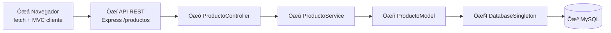

# Parcial - Gesti├│n de Inventario (MVP)

**Integrantes**

| Integrante | Rol en el equipo |
|------------|------------------|
| Aguirre Claudio | Backend MVC, patrones, API REST, estructura `src/` y `public/` |
| Albano Julieta | Tests con Jest, validaciones, integración y rama de referencia más actualizada |
| Windholz Cristhian | Documentación (`README.md`, `docs/ENSAYO-DEFENSA-ORAL.md`, `docs/DEFENSA-ORAL.md`): diagrama, patrones, install/run/test, Git, defensa oral |

Aplicaci├│n CRUD de inventario de productos que cumple **arquitectura MVC** y tres **patrones de dise├▒o**: Singleton, Decorator y Strategy.

> **Rama de referencia (c├│digo):** `rama-AlbanoJulieta` ÔÇö contiene la implementaci├│n y los tests m├ís recientes del grupo.  
> **Rama de esta entrega (documentaci├│n):** `rama-WindholzCristhian` ÔÇö incluye este README ampliado para la consigna y la defensa oral.

---

## Índice

- [**Gu├¡a r├ípida: install + run + test**](#gu├¡a-r├ípida-install--run--test) ÔåÉ empezar aqu├¡
1. [Stack y arquitectura MVC](#1-stack-y-arquitectura-mvc)
2. [Diagrama de flujo (ítem consigna)](#2-diagrama-de-flujo-ítem-consigna)
3. [Patrones de dise├▒o](#3-patrones-de-dise├▒o) (3.1, 3.3, 3.4 ÔÇö defendible en oral)
4. [Ejecutar tests (`npm test`)](#4-ejecutar-tests-npm-test) ÔÇö cuando Albano termine / tras merge
5. [Git y trabajo en equipo](#5-git-y-trabajo-en-equipo)
6. [Criterio de ÔÇ£listoÔÇØ](#6-criterio-de-listo)
7. [Defensa oral (guía defendible)](#7-defensa-oral-guía-defendible)
- [Ensayo completo de defensa (documento)](docs/ENSAYO-DEFENSA-ORAL.md)
- [Apéndice: preguntas incómodas (oral)](docs/DEFENSA-ORAL.md)
8. [API REST y base de datos](#8-api-rest-y-base-de-datos)

---

## Guía rápida: install + run + test

Pasos en orden para **correr el proyecto completo** y **validar tests**. Usar la rama con c├│digo (`rama-AlbanoJulieta`) o la rama ya fusionada del equipo.

### Requisitos previos

| Herramienta | Para qu├® |
|-------------|----------|
| [Node.js](https://nodejs.org/) (LTS) | `npm install`, `npm start`, `npm test` |
| [XAMPP](https://www.apachefriends.org/) | MySQL en `localhost` ÔÇö solo para **run** (app con BD), no para **test** |

### Paso 1 ÔÇö Clonar / actualizar y elegir rama

```bash
git clone <url-del-repo>
cd Parcial_Windholz_Ingenieria
git fetch origin
git checkout rama-AlbanoJulieta    # c├│digo + tests (referencia del grupo)
# o, tras el merge final:
# git checkout rama-AlbanoJulieta && git merge rama-WindholzCristhian
```

### Paso 2 ÔÇö Instalar dependencias

```bash
npm install
```

Instala Express, mysql2, cors y (en rama Albano) **Jest** como devDependency.

### Paso 3 ÔÇö Base de datos (solo para `npm start`)

1. Iniciar **MySQL** desde el panel de XAMPP.
2. En phpMyAdmin ejecutar:

```sql
CREATE DATABASE IF NOT EXISTS tienda;
USE tienda;
CREATE TABLE IF NOT EXISTS productos (
  id INT AUTO_INCREMENT PRIMARY KEY,
  nombre VARCHAR(100) NOT NULL,
  precio DECIMAL(10,2) NOT NULL,
  stock INT NOT NULL DEFAULT 0,
  marca VARCHAR(100) NOT NULL
);
```

3. Revisar credenciales en `src/config/DatabaseSingleton.js` (`host`, `user`, `password`, `database: 'tienda'`).

### Paso 4 ÔÇö Ejecutar la aplicaci├│n (`npm start`)

```bash
npm start
```

| Verificaci├│n | Esperado |
|--------------|----------|
| Consola | `Servidor corriendo en puerto 3000` y `MySQL conectado` |
| Navegador | Abrir **http://localhost:3000** ÔÇö listado CRUD de productos |
| API | `GET http://localhost:3000/productos?estrategia=lista` devuelve JSON |

**Si falla:** MySQL apagado ÔåÆ error de conexi├│n; puerto 3000 ocupado ÔåÆ cerrar otro proceso Node.

### Paso 5 ÔÇö Ejecutar tests (`npm test`)

> Aplica cuando la rama incluye la carpeta `__tests__/` (entrega de **Albano Julieta** en `rama-AlbanoJulieta`). No hace falta XAMPP.

```bash
npm test
```

| Verificaci├│n | Esperado |
|--------------|----------|
| Salida | `Test Suites: 5 passed` |
| MySQL | **No** debe estar levantado para estos tests unitarios |

Detalle de cada suite ÔåÆ [┬º4 Ejecutar tests](#4-ejecutar-tests-npm-test).

### Resumen de comandos

```bash
npm install          # una vez por máquina / tras pull
npm start            # app + MySQL (XAMPP)
npm test             # Jest, sin MySQL (rama Albano)
```

---

## 1. Stack y arquitectura MVC

- **Backend:** Node.js + Express (MVC en `src/`)
- **Base de datos:** MySQL (XAMPP)
- **Frontend:** HTML + CSS + JavaScript vanilla (MVC en `public/js/`)

### Backend (`src/`)

| Capa | Responsabilidad | Archivos |
|------|-----------------|----------|
| **Entidad** | Objeto de dominio (datos del producto) | `models/Producto.js` |
| **Modelo** | Solo persistencia CRUD (SQL) | `models/ProductoModel.js` |
| **Servicio** | L├│gica de negocio; usa Strategy y Decorator | `services/ProductoService.js` |
| **Controlador** | Solo HTTP: validaci├│n de request, status y JSON | `controllers/ProductoController.js` |
| **Rutas** | Enrutamiento Express | `routes/productoRoutes.js` |

**Datos vs lógica:** `Producto` solo guarda campos y `toJSON()`. `ProductoModel` solo ejecuta SQL vía `DatabaseSingleton`. `ProductoService` concentra validaciones, Strategy (precio) y Decorator (descripción).

### Frontend (`public/js/`)

| Capa | Archivos |
|------|----------|
| Modelo (API) | `models/ProductoApiModel.js` |
| Vista (DOM) | `views/ProductoView.js` |
| Controlador UI | `controllers/ProductoUIController.js` |

---

## 2. Diagrama de flujo (ítem consigna)

**Requisito de la consigna:** diagrama que muestre el recorrido **Navegador  API  Controller  Servicio/Modelo  Singleton  MySQL**.



**Qu├® demuestra cada paso (para corregir / oral):**

| Paso | Componente | Qu├® hace | Qu├® NO hace |
|------|------------|----------|-------------|
| Ôæá | Navegador | `fetch` JSON; UI en MVC cliente | No toca MySQL |
| Ôæí | API REST | Enruta verbos HTTP, CORS, JSON | No calcula precios ni SQL |
| Ôæó | Controller | Parsea `id`, query `estrategia`, c├│digos HTTP | No conoce tablas ni descuentos |
| Ôæú | Service | Validaci├│n, Strategy, Decorator | No escribe SQL directo |
| Ôæñ | Model | `SELECT` / `INSERT` / `UPDATE` / `DELETE` | No aplica reglas de precio |
| ÔæÑ | Singleton | Una conexi├│n MySQL compartida | No es capa de negocio |
| ﾻ | MySQL | Persistencia `tienda.productos` |  |

**Ejemplo concreto (GET listar):** el usuario elige estrategia `mayorista` en el frontend ÔåÆ `ProductoApiModel` llama `GET /productos?estrategia=mayorista` ÔåÆ `ProductoController.listar` ÔåÆ `ProductoService.listarConPresentacion` ÔåÆ `ProductoModel.obtenerTodos` ÔåÆ `DatabaseSingleton.consultar` ÔåÆ filas en MySQL ÔåÆ el servicio decora descripci├│n y calcula `precioCalculado` ÔåÆ JSON al navegador.

---

## 3. Patrones de dise├▒o

En las subsecciones **3.3** y **3.4** se exige **problema real del dominio** + **alternativa descartada** + **por qu├® se eligi├│ el patr├│n** (defendible en oral).

### 3.1 Singleton

**Archivo:** `src/config/DatabaseSingleton.js`

```js
const db = DatabaseSingleton.obtenerInstancia();
```

| | |
|---|---|
| **Problema real** | El inventario se guarda en MySQL. Si `ProductoModel`, un futuro `UsuarioModel` y scripts de mantenimiento cada uno llaman `mysql.createConnection()`, se repiten credenciales, se abren muchas conexiones y en entornos como XAMPP (límite bajo de conexiones) aparecen errores `Too many connections` o conexiones que nadie cierra. |
| **Alternativa descartada A** | **Conexi├│n nueva por query:** f├ícil al inicio, pero cada operaci├│n paga handshake TCP + auth ÔåÆ lento e inestable bajo carga. |
| **Alternativa descartada B** | **Pool (`createPool`):** correcto en producci├│n, pero para el parcial agrega tama├▒o de pool, timeouts y manejo de cola sin aportar al aprendizaje del patr├│n Singleton pedido. |
| **Decisión** | Una instancia única (`obtenerInstancia()`) con `consultar()` promisificado; todo el acceso SQL pasa por ahí. |

**Trade-off documentado:** conexi├│n ├║nica = simple y suficiente en MVP; en producci├│n migrar a pool por concurrencia.

---

### 3.3 Decorator

**Archivo:** `src/patterns/decorator/ProductoDecorator.js`  
**Uso:** `ProductoService.enriquecerProducto()`  campo `descripcion` en la respuesta JSON.

**Comportamiento**

- Descripci├│n base: nombre, precio, stock, marca.
- `AlertaStockBajoDecorator`: agrega `| ÔÜá STOCK BAJO` si `stock < 5`.
- `EtiquetaMarcaPremiumDecorator`: agrega `| Ôÿà MARCA PREMIUM` si marca Ôêê {Samsung, Apple, Sony, LG}.

**Problema real (dominio inventario)**

En un listado de dep├│sito, el encargado debe ver **de un vistazo** si hay que reponer stock y si el ├¡tem es de marca premium, **sin cambiar** los datos guardados en la tabla `productos`. Esas reglas son de **presentaci├│n enriquecida**, no columnas nuevas en la BD: ma├▒ana puede pedirse ÔÇ£producto discontinuadoÔÇØ u ÔÇ£oferta del d├¡aÔÇØ y las reglas se combinan (stock bajo **y** premium a la vez).

**Alternativa descartada 1 ÔÇö `if` encadenados en el servicio**

```js
// Anti-ejemplo: crece sin control
let desc = `${p.nombre}...`;
if (p.stock < 5) desc += ' | STOCK BAJO';
if (esPremium(p.marca)) desc += ' | PREMIUM';
// cada regla nueva = otro if en el mismo m├®todo
```

- **Por qu├® se descarta:** viola abierto/cerrado; mezcla todas las reglas en un solo m├®todo; dif├¡cil testear cada regla aislada.

**Alternativa descartada 2 ÔÇö Herencia**

`class ProductoPremiumConStockBajo extends ProductoPremium extends Producto` 

- **Por qu├® se descarta:** combinaci├│n de N reglas ÔåÆ explosi├│n de subclases (2 decoradores = 4 clases posibles; 3 reglas = 8).

**Alternativa descartada 3 ÔÇö L├│gica en el HTML (`index.html` / vista)**

- **Por qu├® se descarta:** duplica reglas si ma├▒ana hay app m├│vil o otro cliente; la API deber├¡a devolver la misma sem├íntica para todos los clientes.

**Decisi├│n (Decorator)**

Cadena: `ProductoComponente`  `AlertaStockBajoDecorator`  `EtiquetaMarcaPremiumDecorator`. Cada clase envuelve al anterior y solo extiende `obtenerDescripcion()`. La entidad `Producto` y el SQL **no se modifican**.

**C├│mo defenderlo en oral (frase lista):** *ÔÇ£Decorator nos permite sumar etiquetas de forma composable; agregar una regla nueva es una clase m├ís en la cadena, no tocar las existentes.ÔÇØ*

**Prueba asociada (rama Albano):** `__tests__/ProductoDecorator.test.js`

---

### 3.4 Strategy

**Archivo:** `src/patterns/strategy/PrecioStrategy.js`  
**Uso:** `PrecioContexto` dentro de `ProductoService`; parámetro `?estrategia=` o selector en UI.

| Estrategia | Clase | Regla |
|------------|-------|--------|
| `lista` | `PrecioListaStrategy` | Precio tal cual en BD |
| `mayorista` | `PrecioMayoristaStrategy` | Precio ├ù 0,85 (ÔêÆ15 %) |
| `promocion` | `PrecioPromocionStrategy` | Precio × 0,75 solo si `stock >= 10` |

**Problema real (dominio inventario)**

La misma fila de producto se vende a **distintos tipos de cliente**: consumidor final (lista), comercio (mayorista) y campa├▒a promocional (descuento condicionado al stock disponible). El precio base vive en MySQL; las reglas de descuento **cambian seg├║n contexto** y no deben duplicar productos ni tablas `productos_mayorista`, `productos_promo`, etc.

**Alternativa descartada 1 ÔÇö `switch` en el servicio**

```js
// Anti-ejemplo
switch (tipo) {
  case 'mayorista': return precio * 0.85;
  case 'promocion': return producto.stock >= 10 ? precio * 0.75 : precio;
  ...
}
```

- **Por qu├® se descarta:** cada estrategia nueva obliga a editar el mismo `switch`; mezcla reglas de negocio en un solo bloque; el controlador podr├¡a tentarse a copiar l├│gica.

**Alternativa descartada 2 ÔÇö Tres endpoints**

`/productos-lista`, `/productos-mayorista`, `/productos-promocion`

- **Por qu├® se descarta:** triplica listados, validaciones y manejo de errores en Controller/Service.

**Alternativa descartada 3 ÔÇö Columnas extra en BD** (`precio_mayorista`, `precio_promo`)

- **Por qu├® se descarta:** los precios derivados quedan desincronizados si cambia `precio` o `stock`; la promoci├│n depende del stock **actual**, debe calcularse en tiempo de lectura.

**Decisi├│n (Strategy)**

`PrecioContexto.establecerEstrategia(tipo)` intercambia el algoritmo en runtime. El servicio expone `precioCalculado` y `estrategia` en JSON sin que el modelo SQL conozca descuentos.

**C├│mo defenderlo en oral:** *ÔÇ£Strategy encapsula cada pol├¡tica de precio; el cliente elige la estrategia por query y el servicio solo delega en el contexto.ÔÇØ*

**Pruebas asociadas (rama Albano):**

- `__tests__/PrecioListaStrategy.test.js`
- `__tests__/PrecioMayoristaStrategy.test.js`
- `__tests__/PrecioPromocionStrategy.test.js`
- `__tests__/ProductoService.test.js` (validaciones + integraci├│n con estrategia)

---

## 4. Ejecutar tests (`npm test`)

### Cuándo usar esta sección

| Momento | Qu├® hacer |
|---------|-----------|
| **Ahora (entrega individual Windholz)** | Solo documentaci├│n; los tests viven en `rama-AlbanoJulieta`. |
| **Cuando Albano termine** | Confirmar en su rama: `__tests__/`, script `"test": "jest --runInBand"` en `package.json`, `npm test` en verde. |
| **Tras merge del equipo** | En la rama unificada, cualquier integrante ejecuta `npm test` según la [guía rápida § Paso 5](#paso-5--ejecutar-tests-npm-test). |

### Responsable

**Albano Julieta** ÔÇö implementaci├│n Jest en `rama-AlbanoJulieta` (5 suites: Strategy ├ù3, Decorator, Service).

### Comandos

```bash
git checkout rama-AlbanoJulieta
npm install
npm test
```

En `package.json`:

```json
"scripts": {
  "start": "node server.js",
  "test": "jest --runInBand"
}
```

`jest --runInBand` ejecuta los tests **en serie** (más estable si hay mocks compartidos).

### Qu├® se prueba (sin MySQL)

| Archivo | Patr├│n / capa | Qu├® valida |
|---------|---------------|------------|
| `__tests__/PrecioListaStrategy.test.js` | Strategy | Precio sin modificar |
| `__tests__/PrecioMayoristaStrategy.test.js` | Strategy | ÔêÆ15 % (`├ù 0,85`) |
| `__tests__/PrecioPromocionStrategy.test.js` | Strategy | 25 % solo si `stock >= 10` |
| `__tests__/ProductoDecorator.test.js` | Decorator | `STOCK BAJO` y `MARCA PREMIUM` |
| `__tests__/ProductoService.test.js` | Service | `validarDatos`, `ValidationError` |

- **No** abrir XAMPP para `npm test`: son pruebas **unitarias** de l├│gica pura.
- Si en el futuro se testea `ProductoModel` con BD real, **mockear** `DatabaseSingleton` (no ejecutar SQL en Jest).

### Salida esperada (cuando Albano termin├│)

```
 PASS  __tests__/PrecioListaStrategy.test.js
 PASS  __tests__/PrecioMayoristaStrategy.test.js
 PASS  __tests__/PrecioPromocionStrategy.test.js
 PASS  __tests__/ProductoDecorator.test.js
 PASS  __tests__/ProductoService.test.js

Test Suites: 5 passed, 5 total
```

### Si `npm test` falla

1. ¿Estás en una rama con carpeta `__tests__/`? (`git branch --show-current`)
2. ┬┐Corriste `npm install` despu├®s del merge?
3. ┬┐Existe `jest` en `devDependencies`?
4. No mezclar tests con MySQL apagado solo si alg├║n test importa el modelo sin mock ÔÇö en la rama Albano no deber├¡a ocurrir.

---

## 5. Git y trabajo en equipo

### Modelo de ramas (entrega individual ÔåÆ unificaci├│n)

El profesor pidi├│ trabajo **por integrante en su rama**; al final el equipo **unifica** en una rama con c├│digo + README.

```
origin
 rama-AguirreClaudio     Claudio
Ôö£ÔöÇÔöÇ rama-AlbanoJulieta     ÔåÉ Julieta (c├│digo + tests, m├ís actualizada)
 rama-WindholzCristhian  Cristhian (este README)
```

### Qui├®n hizo qu├®

| Integrante | Rama | Entregable principal | Archivos clave |
|------------|------|----------------------|----------------|
| **Aguirre Claudio** | `rama-AguirreClaudio` | Backend/frontend MVC, API REST, patrones Singleton / Decorator / Strategy, `server.js`, estructura `src/` y `public/` | `src/controllers/`, `src/services/`, `src/patterns/`, `public/js/` |
| **Albano Julieta** | `rama-AlbanoJulieta` | Todo lo anterior + **tests Jest**, `ValidationError`, `.gitignore`, ajustes finales; **rama de referencia para ejecutar** `npm start` y `npm test` | `__tests__/`, `package.json` (script `test`) |
| **Windholz Cristhian** | `rama-WindholzCristhian` | **Documentación:** diagrama Mermaid, patrones 3.3/3.4 (problema + alternativa), Git, [guía install/run/test](#guía-rápida-install--run--test), [defensa oral §7](#7-defensa-oral-guía-defendible) | `README.md` |

### Tabla integrante ↔ commits (evidencia 50/50)

Commits reales del historial del repositorio (rama `rama-WindholzCristhian` tras integrar las tres ramas). Verificación: `git shortlog -sn` y `git log --oneline`.

| Integrante | Autor en Git | Rama | Commits (ejemplos) | Rol |
|------------|--------------|------|-------------------|-----|
| **Aguirre Claudio** | `Fermaster19` | `rama-AguirreClaudio` | `5b8bfa4` first commit · `d5388ea` capa servicio + refactor controlador · `a8cd394` trade-off Singleton · `4877b20` validación en servicio (`ValidationError`) | Backend MVC, patrones, API |
| **Albano Julieta** | `albano-juli` | `rama-AlbanoJulieta` | `cd99e4a` Jest + script `npm test` · `0c3074e` test PrecioLista · `a6a5352` test Decorator · `6834582` documentación tests sin XAMPP | Tests y ajustes finales |
| **Windholz Cristhian** | `Windholz-CV` | `rama-WindholzCristhian` | `0ac5fbf` diagrama Mermaid · `508a44f` patrones 3.3/3.4 · `f488716` fix MVC vista (`mostrarMensajeLista`) · `619fc89` guion defensa oral | README, diagrama, Git, oral |

| Integrante | Cantidad de commits en historial unificado |
|------------|---------------------------------------------|
| Aguirre Claudio | 7 |
| Albano Julieta | 9 |
| Windholz Cristhian | 11 |

**Total:** 3 autores, 27+ commits (no solo `first commit`). Cada integrante aportó en su rama antes del merge final.

### Flujo acordado

1. Cada uno hace **commit/push en su rama** (sin tocar la de los demás hasta el merge).
2. Julieta confirma **`npm test` en verde** en `rama-AlbanoJulieta` (cuando termine tests).
3. Cristhian mantiene **README actualizado** en `rama-WindholzCristhian`.
4. El equipo mergea README + c├│digo en **`rama-AlbanoJulieta`** (recomendado) o rama `main` si el profe la define.

### C├│mo mergear el README actualizado (paso a paso)

**Recomendado:** base = rama de Julieta + traer solo documentaci├│n de Cristhian.

```bash
# 1. Actualizar remoto
git fetch origin

# 2. Base con c├│digo y tests
git checkout rama-AlbanoJulieta
git pull origin rama-AlbanoJulieta

# 3. Integrar README de Cristhian
git merge rama-WindholzCristhian -m "docs: README diagrama, patrones, install/run/test, oral"

# 4. Si hay conflicto en README.md:
#    - Conservar diagrama Mermaid, §3.3, §3.4, guía rápida, §4 tests, §5 Git, §7 oral
#    - Conservar de la rama base cualquier detalle de API/BD que no est├® duplicado

# 5. Verificar proyecto unificado
npm install
npm test    # 5 suites (Julieta)
npm start   # CRUD + MySQL (XAMPP)

# 6. Subir rama integrada
git push origin rama-AlbanoJulieta
```

**Alternativa** (entregar todo en rama Windholz): mergear `rama-AlbanoJulieta`  `rama-WindholzCristhian` y resolver conflictos dejando este `README.md` completo.

### Commits en rama individual (Cristhian)

```bash
git checkout rama-WindholzCristhian
git add README.md
git commit -m "docs: install/run/test, tests Albano, Git, defensa oral"
git push origin rama-WindholzCristhian
```

---

## 6. Criterio de ÔÇ£listoÔÇØ

Marcar cuando est├® verificado en la **rama unificada** (base `rama-AlbanoJulieta` + merge de documentaci├│n).

### Documentaci├│n (rama Windholz ÔÇö esta entrega)

- [x] **Diagrama Mermaid** (┬º2): Navegador ÔåÆ API ÔåÆ Controller ÔåÆ Servicio ÔåÆ Modelo ÔåÆ Singleton ÔåÆ MySQL
- [x] **Patr├│n 3.3 Decorator:** problema real + alternativas descartadas + decisi├│n
- [x] **Patr├│n 3.4 Strategy:** problema real + alternativas descartadas + decisi├│n
- [x] **Singleton 3.1** documentado con trade-off pool vs conexi├│n ├║nica
- [x] **Sección Git / equipo** (§5): ramas, roles, tabla integrante ↔ commits (50/50), cómo mergear README
- [x] **Guía install + run + test** (sección rápida al inicio)
- [x] **Secci├│n ejecutar tests** (┬º4) ÔÇö referencia rama Albano
- [x] **Guía defensa oral defendible** (§7 + [docs/DEFENSA-ORAL.md](docs/DEFENSA-ORAL.md))
- [ ] README fusionado sin conflictos en rama final del grupo

### C├│digo y funcionalidad (rama Albano / integrada)

- [ ] MVC backend y frontend operativos
- [ ] CRUD persiste en `tienda.productos`
- [ ] Singleton, Decorator y Strategy en ejecuci├│n (`npm start`)
- [ ] `npm test` ÔÇö **5 suites en verde** (pendiente hasta merge con rama Albano)
- [ ] Validaciones (`ValidationError`  HTTP 400)

### Entrega final equipo

- [ ] Merge de las tres ramas completado
- [ ] Un solo README coherente con el c├│digo del repo
- [ ] Demo oral ensayada con diagrama §2 y patrones §3

---

## 7. Defensa oral (guía defendible)

Objetivo: poder explicar en **2–3 minutos** el flujo, los **tres patrones con problema y alternativa descartada**, y cómo se probó el proyecto — sin leer el README palabra por palabra.

**Material de apoyo:** diagrama §2, tablas §3.3 y §3.4, [guía install/run/test](#guía-rápida-install--run--test).

### Apéndice — Preguntas incómodas (doc interno)

Guion extendido, respuestas a preguntas difíciles del profesor y checklist antes del oral:

**[docs/DEFENSA-ORAL.md](docs/DEFENSA-ORAL.md)** — uso interno del equipo; complementa esta sección (MVC falso, Singleton “global”, merge de ramas, producción, demo fallida, etc.).

Usar este guion; apoyarse en el diagrama del §2.

### Apertura (20 s)

*ÔÇ£Tenemos un CRUD de inventario con MVC en cliente y servidor, MySQL, y tres patrones: Singleton para la conexi├│n, Strategy para precios seg├║n tipo de cliente, y Decorator para enriquecer la descripci├│n en listados.ÔÇØ*

### Recorrido del diagrama (40 s)

1. El **navegador** solo habla HTTP/JSON.
2. La **API** en Express enruta a **ProductoController**.
3. El **servicio** valida y aplica Strategy + Decorator.
4. El **modelo** ejecuta SQL vía **Singleton** hacia **MySQL**.

*ÔÇ£Separar capas evita que el frontend conozca la BD o que el controlador calcule descuentos.ÔÇØ*

### Singleton (30 s)

- **Problema:** muchas conexiones o config duplicada.
- **Descartamos:** pool (complejidad) y conexi├│n por request (lento).
- **Elegimos:** una instancia con `obtenerInstancia()`.

### Decorator ÔÇö 3.3 (30 s)

- **Problema:** mostrar alertas de stock y marca premium sin nuevas columnas.
- **Descartamos:** if gigante, herencia, l├│gica en HTML.
- **Elegimos:** cadena de decoradores; ejemplo: TV LG con stock 3  base + STOCK BAJO + MARCA PREMIUM.

### Strategy ÔÇö 3.4 (30 s)

- **Problema:** mismo producto, precio seg├║n lista/mayorista/promo.
- **Descartamos:** switch, tres endpoints, precios extra en BD.
- **Elegimos:** `?estrategia=mayorista`; promoci├│n depende de `stock >= 10`.

### Tests (20 s)

*ÔÇ£Albano implement├│ Jest: `npm test` corre cinco suites sin MySQL ÔÇö Strategy, Decorator y validaciones del servicio. Install, run y test est├ín en la gu├¡a r├ípida del README.ÔÇØ*

### Demo en vivo (si el profe lo pide)

1. `npm start`  **http://localhost:3000** (CRUD + estrategia en UI).
2. `npm test` ÔåÆ mostrar **5 passed** (rama con `__tests__/`, t├¡picamente `rama-AlbanoJulieta`).

### Cierre (10 s)

*ÔÇ£Mi aporte en la rama Windholz fue documentar arquitectura, diagrama, gu├¡a install/run/test, Git y defensa oral; el c├│digo y tests de referencia est├ín en la rama Albano hasta el merge final.ÔÇØ*

### Preguntas frecuentes del profesor

| Pregunta | Respuesta corta |
|----------|-----------------|
| ┬┐Por qu├® no pool? | MVP y consigna Singleton; pool para producci├│n. |
| ┬┐D├│nde est├í el Decorator? | `ProductoService.enriquecerProducto` ÔåÆ `decorarProducto`. |
| ┬┐C├│mo cambio la estrategia? | Query `estrategia` o selector en UI ÔåÆ `PrecioContexto`. |
| ┬┐Qu├® pasa si promoci├│n y stock &lt; 10? | `PrecioPromocionStrategy` devuelve precio lista. |
| ┬┐Controller tiene l├│gica de negocio? | No; solo HTTP y delega al servicio. |
| ┬┐C├│mo corro el proyecto? | Gu├¡a r├ípida: `npm install` ÔåÆ BD en XAMPP ÔåÆ `npm start` ÔåÆ `npm test`. |

### Checklist ÔÇ£defendible en oralÔÇØ (antes de presentar)

- [ ] Recorrer el diagrama §2 de punta a punta (7 pasos).
- [ ] Por cada patr├│n: **problema real** + **una alternativa descartada** + **decisi├│n**.
- [ ] Saber qu├® hizo cada compa├▒ero (tabla ┬º5).
- [ ] Poder ejecutar `npm start` y `npm test` en la rama integrada (o explicar que tests están en rama Albano hasta el merge).

---

## 8. API REST y base de datos

> **Install, run y test:** ver [Gu├¡a r├ípida](#gu├¡a-r├ípida-install--run--test) (pasos 2ÔÇô5).

### Estructura del proyecto (rama integrada)

```
Parcial-1/
Ôö£ÔöÇÔöÇ server.js
Ôö£ÔöÇÔöÇ src/
Ôöé   Ôö£ÔöÇÔöÇ config/DatabaseSingleton.js
Ôöé   Ôö£ÔöÇÔöÇ controllers/ProductoController.js
Ôöé   Ôö£ÔöÇÔöÇ models/Producto.js, ProductoModel.js
Ôöé   Ôö£ÔöÇÔöÇ services/ProductoService.js
Ôöé   Ôö£ÔöÇÔöÇ routes/productoRoutes.js
Ôöé   ÔööÔöÇÔöÇ patterns/decorator/, strategy/
Ôö£ÔöÇÔöÇ public/          # frontend MVC
ÔööÔöÇÔöÇ __tests__/       # Jest (rama Albano)
```

### API REST

| M├®todo | Ruta | Descripci├│n |
|--------|------|-------------|
| GET | `/productos?estrategia=lista` | Listar con precio calculado y descripci├│n decorada |
| GET | `/productos/:id?estrategia=promocion` | Buscar por ID |
| POST | `/productos` | Crear |
| PUT | `/productos/:id` | Actualizar |
| DELETE | `/productos/:id` | Eliminar |
